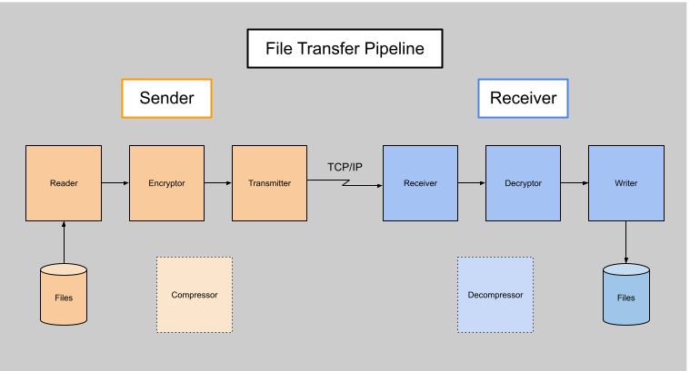

# trit-file-transfer
**trit** is a CLI tool to transfer files over a local network using TCP/IP.

## Installation
### Ubuntu
1. Download the release binary
2. Make the file executable with 
```bash 
chmod +x trit 
```
3. Move it to a directory on your shell's `PATH`,  e.g.:
```bash 
sudo mv trit /usr/local/bin/
```
4. Verify the installation
```bash 
trit help
```

Other Linux distributions and macOS have not been tested. Windows is not currently supported.

## Usage
The basic usage flow is as follows:
1. Sender stages files to send
2. Receiver listens for connections from sender
3. Sender connects to receiver and sends a transfer request
4. Receiver accepts or denies the transfer request
5. Sender begins reading and transferring the staged files if the request is accepted
6. Receiver receives and writes the files

### Commands
Commands follow this syntax: `trit <command> [options]`
| Command                            | Description                                 |
| ---------------------------------- | ------------------------------------------- |
| `trit add <file_pattern>...`       | Stage file(s) for transfer                  |
| `trit drop <file_pattern>...`      | Unstage previously staged file(s)           |
| `trit list`                        | List currently staged files                 |
| `trit send <ip> <port> [password]` | Send a file transfer request to a receiver  |
| `trit receive [password]`          | Start listening for incoming file transfers |
| `trit help`                        | Display help message                        |

### File Pattern Syntax
You can use glob-style patterns when adding or dropping files:
| Pattern         | Matches                                                                           |
| --------------- | --------------------------------------------------------------------------------- |
| `*.ext`         | All files with the given extension in the current directory                       |
| `name.*`        | All files with the given base name and any extension in the current directory     |
| `*`             | All files in the current directory                                                |
| `**`            | All files recursively in the current directory and subdirectories                 |
| `**/*.ext`      | All files with the given extension recursively                                    |
| `path/to/*.ext` | Files with the given extension directly inside `path/to/`                         |
| `path/to/**`    | All files recursively under `path/to/`                                            |
| `?`             | Any single character                                                              |

## Build
### Ubuntu
#### First time setup
1. Install dependencies
```bash 
sudo apt install build-essential cmake libasio-dev zlib1g-dev libsodium-dev pkg-config
```

2. Configure the cmake build system by running the following (in the project root directory)
    - Also run this command whenever CMakeLists.txt is modified (e.g. adding new source files)
```bash
cmake -B build -S .
```

#### Compilation
1. Compile and build the project executable
```bash
cmake --build build
```

## Implementation
