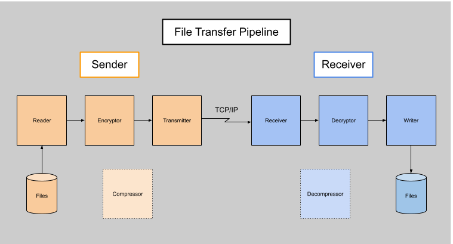

# trit-file-transfer
**trit** is a git-inspired CLI tool for transferring files over a local network using TCP/IP.

Like git, trit uses a **staging area**: you `add` files to a queue, inspect them with `list`, or `drop` any you don't want, then `send` them all at once when you're ready. Staging state is stored in a `.trit/` directory in your working directory.

Transfers are encrypted end-to-end using [libsodium](https://doc.libsodium.org/). A shared password is used to derive an encryption key, and an authentication handshake is performed before any data is exchanged. Files are streamed through a multi-threaded producer-consumer pipeline, allowing reads, encryption, and socket writes to overlap for high throughput.


## Installation
### Runtime Dependencies

Ensure the following libraries are installed on your system
- `zlib1g`
- `libsodium`

On Ubuntu/Debian, install them with:
```bash
sudo apt install zlib1g libsodium23
```

### Ubuntu
1. Build using the instructions in the build section
2. Make the file executable with 
```bash 
chmod +x trit 
```
3. Move it to a directory on your shell's `PATH`,  e.g.:
```bash 
sudo mv trit /usr/local/bin/
```
4. Verify the installation
```bash 
trit help
```

Other Linux distributions and macOS have not been tested. Windows is not currently supported.

## Usage
The basic usage flow is as follows:
1. Sender stages files to send
2. Receiver listens for connections from sender
3. Sender connects to receiver and sends a transfer request
4. Receiver accepts or denies the transfer request
5. Sender begins reading and transferring the staged files if the request is accepted
6. Receiver receives and writes the files

#### Quick Start Example
##### On receiver
```bash
trit receive mypassword
>>> Waiting for connections...
>>> Listening for connection at 10.0.0.189 on port 52525...
... # waits until sender connects
>>> Accept transfer request? (y/n)
y
... # transfer
>>> Files received, transfer complete!
```

##### On sender
```bash
trit add myfile.txt
trit send 10.0.0.189 52525 mypassword
... # waits until transfer is accepted
>>> Sending files...
... # transfer
>>> Files sent, transfer complete!
```

### Commands
Commands follow this syntax: `trit <command> [options]`
| Command                            | Description                                 |
| ---------------------------------- | ------------------------------------------- |
| `trit add <file_pattern>...`       | Stage file(s) for transfer                  |
| `trit drop <file_pattern>...`      | Unstage previously staged file(s)           |
| `trit list`                        | List currently staged files                 |
| `trit clear`                       | Clear all staged files                      |
| `trit send <ip> <port> [password]` | Send a file transfer request to a receiver  |
| `trit receive [password]`          | Start listening for incoming file transfers |
| `trit help`                        | Display help message                        |

### File Pattern Syntax
You can use glob-style patterns when adding or dropping files:
| Pattern         | Matches                                                                           |
| --------------- | --------------------------------------------------------------------------------- |
| `*.ext`         | All files with the given extension in the current directory                       |
| `name.*`        | All files with the given base name and any extension in the current directory     |
| `*`             | All files in the current directory                                                |
| `**`            | All files recursively in the current directory and subdirectories                 |
| `**/*.ext`      | All files with the given extension recursively                                    |
| `path/to/*.ext` | Files with the given extension directly inside `path/to/`                         |
| `path/to/**`    | All files recursively under `path/to/`                                            |
| `?`             | Any single character                                                              |

## Build
### Ubuntu
#### First time setup
1. Install dependencies
```bash 
sudo apt install build-essential cmake libasio-dev zlib1g-dev libsodium-dev pkg-config
```

2. Configure the cmake build system by running the following (in the project root directory)
    - Also run this command whenever CMakeLists.txt is modified (e.g. adding new source files)
```bash
cmake -B build -S .
```

#### Compilation
1. Compile and build the project executable
```bash
cmake --build build
```

## Implementation


### Staging System

Trit uses a staging mechanism so users can queue files before sending.
- Staged file paths and a lock directory (`.lock`) are stored under `.trit/` in the current working directory.
- Staging state persists across invocations until a successful send, which clears it automatically.
- Flexible glob patterns are supported for staging and unstaging (e.g., `*`, `name.*`, `**/*.ext`). Passing a directory is also supported and stages all files under it recursively.

### Runtime Metadata & Logging

Trit stores temporary runtime data in two locations:
- Working directory: `.trit/staged.txt` and `.trit/.lock` for staging bookkeeping.
- System temp directory: log file of latest execution at `/tmp/trit/log.txt`.

### Networking Layer

Trit uses a lightweight blocking wrapper (`TcpSocket`) built on top of ASIO (standalone, non-Boost).
- Provides cross-platform `connect`, `accept`, `read`, and `write` primitives.
- Simplifies socket management while remaining platform-agnostic.

### Custom Transfer Protocol

#### Handshake & Encryption

- The key is derived from the password using Argon2 (`crypto_pwhash`) with a random salt.
- File data is encrypted using XChaCha20-Poly1305 (`crypto_secretstream_xchacha20poly1305`), which appends a MAC to each encrypted chunk for authentication and integrity.
- Before file metadata is exchanged, an authentication handshake verifies that both sides derived the same key:
    1. The sender encrypts a fixed known tag with a random nonce and sends the salt, nonce, ciphertext, and stream header.
    2. The receiver derives the key from the salt and password, decrypts and verifies the tag, then replies with a success or failure byte.

#### Transfer Request

Before data transfer begins, the sender sends a serialized `TransferRequest` containing:
- File count, total transfer size, chunk size, final chunk size, and chunk count
- Per-file metadata (relative path, size), encoded with length-prefixed strings and fixed-width integers

#### Chunk Data
Files are streamed as sequences of fixed-size chunks. Each chunk packet includes:
- 8-byte sequence number
- 1-byte compressed flag
- 2-byte original size
- 2-byte chunk size
- Payload (≤ 65 535 bytes)

### Transfer Pipeline

Trit uses a multi-threaded producer-consumer pipeline for high-throughput transfers.

**Sender:**
- Reads files into a shared fixed-size buffer, packing multiple small files into one chunk and splitting large files across multiple chunks.
- Encrypts chunks and sends over socket.
- Uses bounded queues to decouple the read, encrypt, and send stages.
- Tracks chunk progress via a dedicated progress thread.
- Clears the staging area after a successful transfer.

**Receiver:**
- Receives chunks from socket.
- Decrypts and verifies integrity of each chunk.
- Reconstructs files from chunk data, creating any required directories before writing.
- Tracks chunk progress via a dedicated progress thread.

### File I/O Layer

The `FileManager` handles efficient chunking and reconstruction:
- Splits/aggregates files into fixed-size buffers.
- Reassembles files from received chunks.
- Ensures directory structure exists before writes.
- Performs per-file integrity checks against declared sizes.

### Compression (Disabled)
A compression layer was implemented with zlib to optionally reduce chunk sizes. The compressed flag in each packet was reserved for this purpose.

However, testing showed that throughput decreased with compression:
- CPU cost of compressing/decompressing outweighed bandwidth savings.
- Many files (media, archives, executables) are already compressed.

As a result, compression support remains defined in the protocol but is disabled and not integrated into the transfer pipeline.
